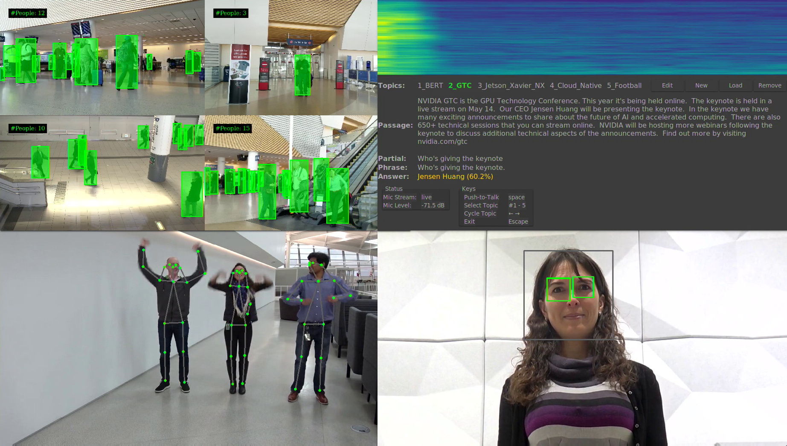
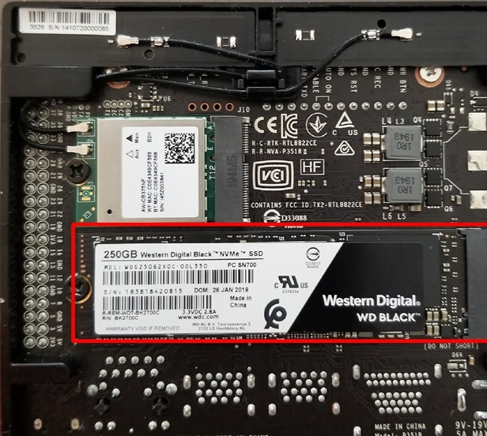

# Cloud-Native Demo on Jetson

This demo exemplifies cloud native development and deployment on the Jetson Xavier NX. The demo is built around the example use case of AI applications for service robots. Service robots are autonomous robots and interact with people usually in retail, hospitality, healthcare, or warehouse settings.

Consider a service robot in a retail setting providing customer service, like interacting with customers and providing helpful answers to customer queries.

These robots need to perform the following tasks:

-   Identify humans
-   Detect when a customer is talking to it
-   Understand where a customer is pointing to while interacting with it
-   Understand what a customer is asking
-   Provide useful answers.

Hence these robots needs multiple AI models such as:

-   People identification to identify humans
-   Gaze detection to detect when a customer is talking to it (as opposed to talking to someone else)
-   Pose detection to detect customer’s pose
-   Speech recognition to detect words in sentences spoken by the customer
-   Natural language processing to understand the sentence, including context, to provide relevant answers back to the customer.
    

Following the cloud native approach to application development, these individual models can be developed independently. Once an individual model is developed, it can be containerized with all dependencies included, and deployed to any Jetson device.

For this demo review we have developed and containerized the models, and have hosted them on [Nvidia GPU Cloud](https://www.nvidia.com/en-us/gpu-cloud/). The demo runs seven models simultaneously as described below:
- [DeepStream Container with people detection](https://ngc.nvidia.com/catalog/containers/nvidia:deepstream-peopledetection):
	- Resnet-18 model with input image size of 960X544X3. The model was converted from TensorFlow to TensorRT.
- [Pose container with pose detection](https://ngc.nvidia.com/catalog/containers/nvidia:jetson-pose):
	- Resnet-18 model with input image resolution of 224X224. The model was converted from PyTorch to TensorRT.
- [Gaze container with gaze container](https://ngc.nvidia.com/catalog/containers/nvidia:jetson-gaze):
	- MTCNN model for face detection with input image resolution of 260X135. The model was converted from Caffe to TensorRT.
	- NVIDIA Facial landmarks model with input resolution of 80X80 per face. The model was converted from TensorFlow to TensorRT.
	- NVIDIA Gaze model with input resolution of 224X224 per left eye, right eye and whole face. The model was converted from TensorFlow to TensorRT.
- [Voice container with speech recognition and Natural Language Processing](https://ngc.nvidia.com/catalog/containers/nvidia:jetson-voice):
	- Quartznet-15X5 model for speech recognition which was converted from PyTorch to TensorRT. 
    - BERT Base/Large models for language model for NLP which were converted from TensorFlow to TensorRT.
    
These containers provide the building blocks of the service robot use case. Making modifications and deploying to any of these applications running in the container is easy and no other container will be affected, giving zero down time and seamless update experience.

### Running the individual demo containers independently

To run the demo containers individually, please refer to the instructions in the corresponding NGC pages for the containers:

-   [DeepStream Container with people detection](https://ngc.nvidia.com/catalog/containers/nvidia:deepstream-peopledetection)    
-   [Pose container with pose detection](https://ngc.nvidia.com/catalog/containers/nvidia:jetson-pose)
-   [Gaze container with gaze container](https://ngc.nvidia.com/catalog/containers/nvidia:jetson-gaze)
-   [Voice container with speech recognition and Natural Language Processing](https://ngc.nvidia.com/catalog/containers/nvidia:jetson-voice)

### Running the Cloud-Native Demo

This demo requires use of M.2 NVMe storage. It can be connected to the m.2 connector underneath the developer kit.

#### Why is NVMe Required for this Demo?

Since these demo containers are not yet fully optimized for storage and memory size, this demo would require connecting a M.2 NVMe storage to Jetson Xavier NX for extra storage and adding a swap space on NVMe for extra virtual memory. The usual path to deploying the containers into production involves optimizing the containers for size and memory. These demo containers have not yet gone through the optimizations.

#### Instructions to Set up NVMe Drive

Connect the NVMe using the M.2 slot below the Developer Kit as shown (in red box) in this picture:


First format the NVMe and then prepare the mount point to mount the NVMe:

``` bash
sudo mkfs.ext4 /dev/nvme0n1

sudo mkdir /home/nvidia/nvme

sudo mount /dev/nvme0n1 /home/nvidia/nvme
```
Once the NVMe is installed and mounted, add the following to /etc/fstab file to automount the NVMe storage and then reboot the developer kit:

``` bash
/dev/nvme0n1 /home/nvidia/nvme ext4 defaults 0 1
```
  

Next, change the docker registry to point to NVMe so that the docker images are stored in NVMe.

Note that the second command in the box below is optional and is required only if you have already pulled some containers to the developer kit. This command will move those docker images to NVMe:

``` bash
sudo mkdir /home/nvidia/nvme/docker

sudo mv /var/lib/docker/* /home/nvidia/nvme/docker/.

sudo ln -s /home/nvidia/nvme/docker /var/lib/docker
```
  

Next, create a file swap on NVMe by following these instructions:

``` bash
Turn off zram:

cd /etc/systemd

sudo mv nvzramconfig.sh nvzramconfig.sh.orig

sudo reboot
```

Add swap file on nvme and verify swap

``` bash
sudo fallocate -l 32G /home/nvidia/nvme/swapfile

sudo chmod 600 /home/nvidia/nvme/swapfile

sudo mkswap /home/nvidia/nvme/swapfile

sudo swapon /home/nvidia/nvme/swapfile

sudo swapon -s
```
  

Automount swap file on boot by editing /etc/fstab and adding below line:

``` bash
/home/nvidia/nvme/swapfile swap swap defaults 0 0
```

Reboot the developer kit after saving the changes to /etc/fstab

#### Pulling the Containers

Pull the 4 demo containers using the pull instruction mentioned in the demo container’s NGC page.

  

#### Running the Demo

First clone this repository:  
``` bash
git clone [https://github.com/NVIDIA-AI-IOT/jetson-cloudnative-demo](https://github.com/NVIDIA-AI-IOT/jetson-cloudnative-demo)
```
  
Go to the directory
``` bash
cd jetson-cloud-native-demo
```

Launch the demo
``` bash  
sudo ./run_demo.sh
```
  
  

-   The script will ask you to ensure that the USB Headset with Mic is connected. Once you make sure it is, please hit the Enter key.
    
-   The script will take approximately two and half minutes to launch all four containers, and run the concurrent inference workloads.
    
-   We recommend that you CLOSE all other applications (e.g, Chrome browser, Word document, etc.) and that you do not interact with the containers during the launch process because it is memory intensive and interactions may cause further slowdown. These containers were created for demo purpose only and (unlike real-world applications) are not optimized for memory and system resource usage. .
    
-   When all four containers are successfully loaded, you can now start interacting with the demo.

Top Left Quadrant - People Detection Container

The top left quadrant of the demo is running a containerized people detection inferencing task using NVIDIA DeepStream. It is analyzing four concurrent video streams to identify the number of people in each stream.

Top Right Quadrant - Natural Language Processing Container

The top right quadrant of the demo is running a containerized Natural Language Processing (NLP) demo using the demanding BERT NLP neural network. This demo takes your questions through voice input on specific topics and provides relevant answers based on the content available under each topic. Please follow these instructions to experience this demo.

1.  Select one of the several available topics by using the left/right arrow key on your keyboard.
    
2.  Read the content of each topic to come up with a question.
    
3.  Press the ‘space’ key on the keyboard and keep it pressed while asking your question into the microphone of the headset. Please speak slowly and loudly and ask your question. For example, under the topic titled GTC, you may want to ask questions such as “What is GTC?” or “Who is presenting the keynote”, “At what time is the keynote?”, “where is room 2?” and other questions. If relevant information is available in the content for your question, then the NLP network will provide a text answer that is shown on the screen. Note that the very first question may take a couple of seconds to register.
    
4.  You can also create your own topic, add your content and ask questions on that content using the “New” topic menu item.
    
5.  These neural networks have been trained but are not finely optimized like in commercial assistants such as Google Assistant or Alexa. These are provided only for demo purposes to convey that Jetson NX is capable of running multiple networks concurrently and deliver real-time performance. A commercial application using Jetson will spend more time fine-tuning the neural network performance.
    

Bottom Left Quadrant - Pose Estimation

This container is running a pose estimation neural network to estimate the pose of people in the input video stream. For example, this can be applied to service robot applications to figure out whether the person in the frame is pointing at a specific product in the store, or asking a delivery robot to stop based on the pose of the person’s hands, or whether the person is standing or sitting down based on pose of the legs.

Bottom Right Quadrant - Gaze Estimation

This container is running a gaze estimation neural network to figure out whether the person in the frame is looking at the robot or looking somewhere else. Whenever the person looks at the robot, the boxes around the person’s eyes turn green. The robot can then start interacting with the person.

To end the demo, please go back to the terminal window by clicking on the terminal icon on the left side of your screen and hit “Enter” to close all containers.

